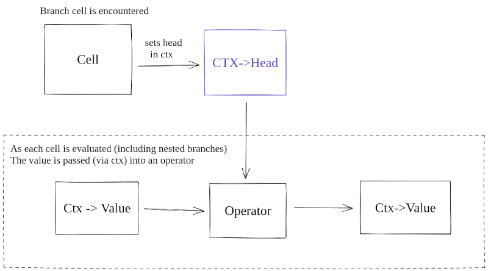

# Vertebae 
Iteration Based Programming Language

## About
Vertebrae is an iteration based language. As a default all functions accept variable length arguments, a design inspired by lisp. In practice, arguments can be chained to effectively produce programs which  require very little code to achieve data processing, and data minipulation tasks.

Here are some examples of the langauge

hello world
```
print < "hello" "world",
```
or
```
:hi < "hello",
print < hi "world",
```
math (count to 10)
```
:x < + 1 2 3 4,
print < x,
```

functions
```
:available < 5,
:itemtype < "ducks",

:my-func <
    ^available < sub < 1 available,,
    print < value "has" available itemtype.

my-func < "sam" "danny" "kazaa" "kim" "shana",
```

outputs:

```
sammy has 4 ducks
danny has 3 ducks
kazaa has 2 ducks
kim has 1 ducks
shana has 0 ducks
```

Where possible patterns are expected to stay continous, i.e. there are no positional arguments, there are binary rounds like if/else but never cases where the first argument does something different than all the rest. all paradigms are indended to be consistent.

The system is modular and intended to be extended from the C source code level.

## Usablility ideas
The main goal is to have something that can be cooperative multiprocessing so the language is implemented entirely without recursion, the whole runtime is processed with a stack based structure, so that it can be paused and resumed in line with the needs of any other part of an application or library.

Functions are run by being the first cell on the left hand side of an arrow, and functons are closed with a ',' or ';' character (implemented identically in the runtime).

# Diagrams flows

### Cell/branch flow

This is the flow of how functions (represented by the head of the set of cells) flow through the language.


This code would look like:

```
print < "Its", 
   + 10 4,
   "Degrees Outside"
```

And it would output `It's 14 Degrees Outside"`

### Head/Operator flow 

As each segment head is encountered, it is assigned an operator, these do everything from print content to a stream, do arithmetic based on cell values, or set the navigation of if/else conditions. Operators do most of the work in the language.



# Status
Presently the base set of functions are working (on the original syntax), this includes

* Iteration based branching and nested control flow
* Lexical variable looking and assignment
* If else branching logic
* Basic operators (+,-,=,*,<,>)
* Basic types with toString and Truthy values
* Functions and function pointers (lamngdas)

# Roadmap 

* Memory management -
There is a design for a reference counting memeory manager that bakes into the `value_obj` system, but it has not yet been implemented.

* Full arrow syntax support -
Presently some functionality is still only supported on the navite '(' based syntax not the new '<-' based one.

* System functionality -
System utils, execvp and io are two main areas of development


# Most influential objects

### Cell
A cell is a single unit of navigation, it holds an initial value or symbol name.

### Operator
The `operator` objects are the way behavior is excecuted, they behave much like the bodies of functions and are assigned to a `head` object when the `head` object is  going to recieves a series of cells.

### Head
`head` objects are records that join a series of cells to an operator.

### Closure 
`closure` objects manage the lexical lookup state of all value, symbols are unwrapped using `swap_for_symbol` in several places throughout the code. The operator in `def_values_op.c` handles instantiating and updating values.

### Context
The `context` object is designed to handle execution iteratively to allow for asynchonous functionality (coming in  latter version). The context object holds everything about the current state of the runtime.

# Layout of the code

### Root dirs 
*src* holds all of the langauge code and *test* holds all of the tests, for the rest of this section it is assumed *src* is the root directory.

### parse
The parse directory handles parsing the script and turning it into a structures that can be run by the runtime. Individual units of work, such as number/string patterns, or open/close cell syntax, are in seperate objects. These objects are processd in a loop with the introduction of each new character. This allows the script to be parsed as a stream, and may later be used for just in time parsing.

### run
The run directory is the entry for the runtime, it holds a minimal router for running through the cells, some operators also effect navigation such as the if/else operator (`contition_op.c`). All navigation is based off of the `state` object (`ctx` in the code). This object is formed in such a way that the execution of the langaue can easily be paused and resumed, to alow for asynchonous processing.

```c
struct crw_state {
    enum CRW_STATUS status;
    enum CRW_HANDLE_STATE handle_state;
    struct head *head;
    struct head *previous;
    /* used mostly by unit tests for now */
    struct head *context;
    struct cell *cell;
    struct stack_item *stack;
    struct value_obj *value;
    struct {
        struct value_obj *true;
        struct value_obj *false;
        struct value_obj *nil;
        struct value_obj *error;
    } builtins;
    void (*next)(struct crw_state *ctx);
    void (*default_handle)(struct operator_ifc *_op, struct crw_state *ctx); 
    struct crw_ctx_data *data;

    /* for debugging */
    int nesting;
};
```

### core
This directory handles all central actions like instantiating `head` objects for when a new list of cells is being sent to a `head` object, and associating an `operator` with that `head`. `closure` objects are also managed here.

### operator
The operator directory contains all the operators that can be assigned to heads to handle the cells sent to them. These are broken out into individual operations using a struct convention.

```c
typedef bool (operator_handle_func)(struct operator_ifc *_op, struct crw_state *ctx);

struct operator_ifc {
    enum OPERATOR_TYPE type;
    struct operator_ifc *(*new)(enum OPERATOR_TYPE type);
    operator_handle_func *handle;
    operator_handle_func *close;
    enum gka_op_lifecycle lifecycle;
};
```

`handle` is a custom function pointer for each operator, this struct interface is used to call all of the operators, by code inside _run_.

Most of the behavior in the language is delegated to `operators`.

### types
This has the value objects and how they are parsed from strings into thier respective types. Value objects use the following struct as an interface.
  
```c
struct value_obj {
    int id;
    enum SL_TYPE type;
    union {
        float float_value;
        int integer;
        struct string *string;
        struct cell *cell;
        struct operator_ifc *operator;
        char c;
        void *custom;
        enum CRW_RESULT result;
    } slot;
    struct string *(*to_string)(struct value_obj *value);
    bool (*truthy)(struct value_obj *value);
    bool (*equals)(struct value_obj *source, struct value_obj *compare);
    enum parse_accent accent;
};
```


# Tech debt

These are areas where the work done so far is not sustainable for the upcoming features.

* The run/state.c has some complexity that could be simpler, the pattern of where branches are started is spread out. _Benefit: implementing system features and async behavior will need this_
* Parse folder structure could use improvement, run_parser initiates the flow but parse_utils has most of the parsing functions in it. _Benefit, new syntax will be better with this._
* Parse src/parse/parse_utils:finalize could be broken down more. _Benefit: function pointers in the new syntax will need this._
* The difference between models and behavior in the types library can be improved. _Benefit: structuring this will help the system features as the types for that are significantly more complex_
